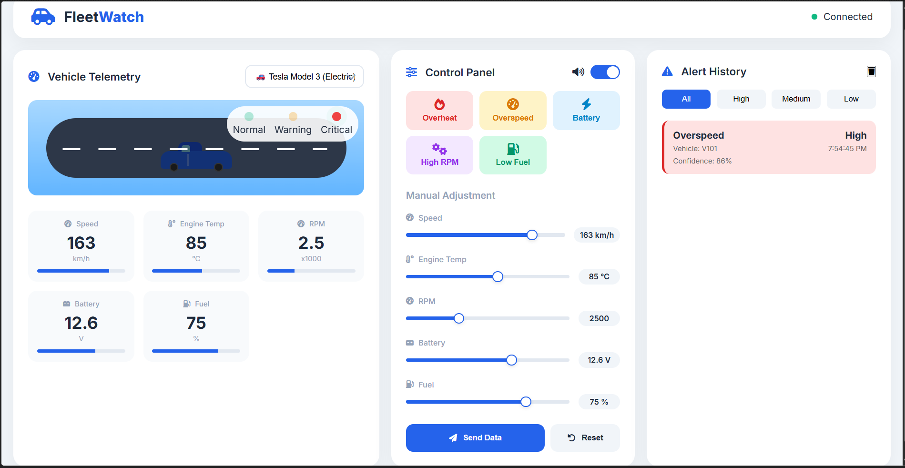
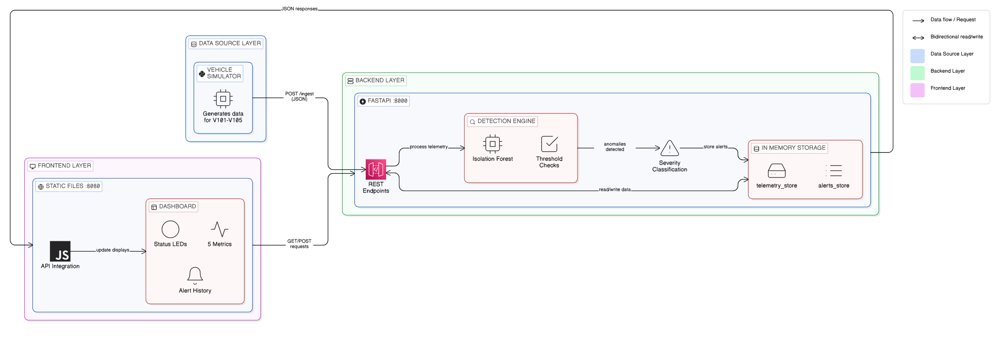

🚗 AI-Based Vehicle Telemetry & Fault Detection System
 

    
<em>Real-time vehicle monitoring with AI-powered fault detection</em> 

 
 
  

      

 
🎯 Overview
AI-Based Vehicle Telemetry & Fault Detection System is a real-time monitoring solution that collects vehicle operational data (speed, temperature, RPM, battery voltage, fuel level) and uses a hybrid approach of rule-based thresholds and machine learning anomaly detection to identify potential faults before they cause breakdowns.

The system features an interactive web dashboard with 3D car animation, live gauges, color-coded alerts, and sound notifications - making it perfect for fleet management, preventive maintenance, and educational purposes.

FEATURES

Intelligent Detection

⚡ Rule-Based Detection-Threshold alerts for known issues
🤖 ML Anomaly Detection-Isolation Forest finds unknown patterns
🎯 Severity Classification-High/Medium/Low with confidence scores
🔔 Sound Alerts	Different-sounds per severity level

User Interface

📱 Responsive Design	Works on desktop, tablet, mobile
🎨 Modern UI	Clean, professional interface
📋 Alert History	Filterable log with timestamps
🎛️ Manual Controls	Sliders to test different scenarios
 

🌐 Live Demo

    

Component	URL	Status
Frontend Dashboard	https://ai-based-vehicle-telemetry-alert-fault.onrender.com	✅ Live
Backend API	https://vehicle-telemetry-api.onrender.com                          ✅ Live
API Documentation	https://vehicle-telemetry-api.onrender.com/docs	            ✅ Live
 
🏗️ System Architecture

  

 

AI-Based-Vehicle-Telemetry-Alert-Fault-Detection-System/
├── 📂 backend/
│   ├── 📄 app.py                 # FastAPI main application
│   ├── 📄 vehicle_simulator.py   # Data generator
│   ├── 📄 requirements.txt       # Python dependencies
│   ├── 📄 Dockerfile              # Container configuration
│   └── 📂 models/                 # ML model storage
│       └── 📄 anomaly_model.pkl   # Trained Isolation Forest
├── 📂 frontend/
│   ├── 📄 index.html                   # Main dashboard
│   ├── 📄 styles.css               # Styling
│   └── 📄 script.js                # Frontend logic
├── 📄 render.yaml                  # Render deployment config
├── 📄 docker-compose.yml           # Docker Compose config
├── 📄 run_all.py                   # Local launcher script
├── 📄 .gitignore                   # Git ignore file
└── 📄 README.md                    # This file

Project Link: https://github.com/Ajaykumarnachimuthu/AI-Based-Vehicle-Telemetry-Alert-Fault-Detection-System

⭐ Support

 If you like this project, please give it a ⭐ on GitHub! 

  

 <b>Made with ❤️ for Hackathons and Innovation</b>    

